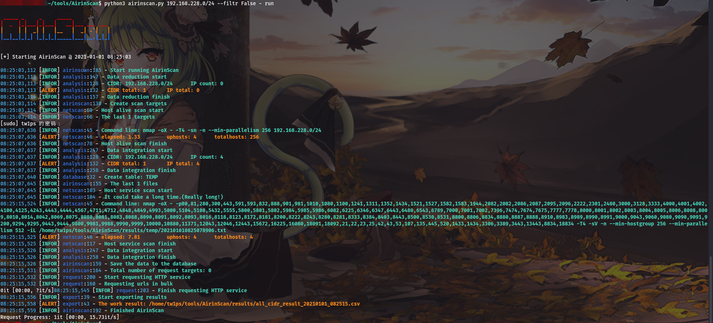

# AirinScan

AirinScan is a network scan tool

## 环境相关

开发系统：`Linux ubuntu 5.4.0-58-generic #64-Ubuntu SMP Wed Dec 9 08:16:25 UTC 2020 x86_64 x86_64 x86_64 GNU/Linux`

测试系统：`Linux kali 5.9.0-kali5-amd64 #1 SMP Debian 5.9.15-1kali1 (2020-12-18) x86_64 GNU/Linux`

Python版本：`3.8.5`

Pip版本：`pip 20.0.2 from /usr/lib/python3/dist-packages/pip (python 3.8)`

## 注意

请注意目标CIDR以避免不必要的麻烦

## 安装

```bash
git clone https://github.com/Tw1ps/AirinScan.git
```

```bash
cd AirinScan/
python3 -m pip install -r requirements.txt
python3 airinscan.py --help
```

## 简单使用

- 准备一个OneForAll扫描结果文件`all_subdomain_result_XXXXXX.csv`，如果是其他同类型文件需要在setting.py中指定相关字段

```bash
python3 airinscan.py ./all_subdomain_result_XXXXXX.csv - run
```

- 手动指定CIDR并关闭筛选

```bash
python3 airinscan.py 192.168.0.0/24 192.168.45.0/24 --filtr False - run
```

## 项目说明

项目地址：https://github.com/Tw1ps/AirinScan

本项目核心为python-nmap提供的扫描功能，并在很多方面上参考/借鉴/偷袭/使用了 [OneForAll](https://github.com/shmilylty/OneForAll) 的代码和资源。

本项目主要用于分析数据，扫描CIDR，并识别存活主机的端口服务信息，对HTTP服务发起请求获取标题。

目前项目代码粗糙，很多方面处于“俺寻思”的状态。

airinscan.py为主程序入口，另外有备用控制standby_control.py

## 功能特性

- 数据分析，能够对给定的数据文件进行CIDR和IP分析，根据CIDR的IP数量从大到小排序。
- 目标筛选，仅对排行前任意项且IP数量大于设定值的CIDR进行扫描。
- 缩小扫描范围，当CIDR的掩码小于设定值会将其划分为如许多个24位掩码的子网段，并分析已有IP分布，仅对存在IP分布的子网段扫描。
- HTTP服务识别，自动获取网页标题。

## 其他说明

命令行仅提供基础参数修改，更多修改请参见 `airin/config/setting.py` 。

本项目在调用nmap扫描参数中添加了sudo特权请求，若要取消该设置请修改 `airin/config/setting.py` 中`netscan.enable_sudo`的值为`False`。

## 目录结构

```bash
.
├── airin
│   ├── analysis.py
│   ├── config
│   │   ├── __init__.py
│   │   ├── log.py
│   │   └── setting.py
│   ├── data
│   │   └── cdn_ip_cidr.json
│   ├── database.py
│   ├── export.py
│   ├── __init__.py
│   ├── netscan.py
│   └── request.py
├── airinscan.py
├── LICENSE
├── README.md
├── requirements.txt
├── standby_control.py
└── test.py

3 directories, 16 files
```

## 鸣谢

感谢大大们出色的Python项目！

## 免责声明

本工具仅能在取得足够合法授权的企业安全建设中使用，在使用本工具过程中，您应确保自己所有行为符合当地的法律法规。 如您在使用本工具的过程中存在任何非法行为，您将自行承担所有后果，本工具所有开发者和所有贡献者不承担任何法律及连带责任。 除非您已充分阅读、完全理解并接受本协议所有条款，否则，请您不要安装并使用本工具。 您的使用行为或者您以其他任何明示或者默示方式表示接受本协议的，即视为您已阅读并同意本协议的约束。

## 使用截图



